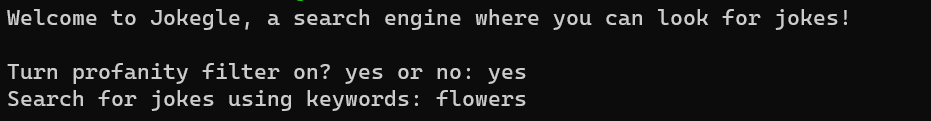

# Jokegle

Jokegle is a search engine with a bank of over 250k jokes. Jokegle uses a vector space model, relevance feedback, and query reformulation to produce top jokes for a query given by a user.


### Usage
1. To run a local instance of Jokegle, clone the repository and create a virtual environment and install the requirements
    ```
    python3 -m venv env
    source env/bin/activate
    pip install -r requirements.txt
    ```
2. This application uses the ``nltk`` library for help with tokenization, stopword removal, and stemming of text. Downloading the necessary data for the library can be done by running:
    ```
    python3 download.py
    ```

3. The json files containing the datasets are found in the ``jokes/`` directory. To create the inverted index and calculate idfs for terms, run
    ```
    python3 create_inverted_index.py
    ```
    Two new files should appear called ``joke_data.json`` and ``term_idfs.json``.

4. To run the search engine application, 
    ```
    python3 joke_engine.py
    ```
The following should appear



